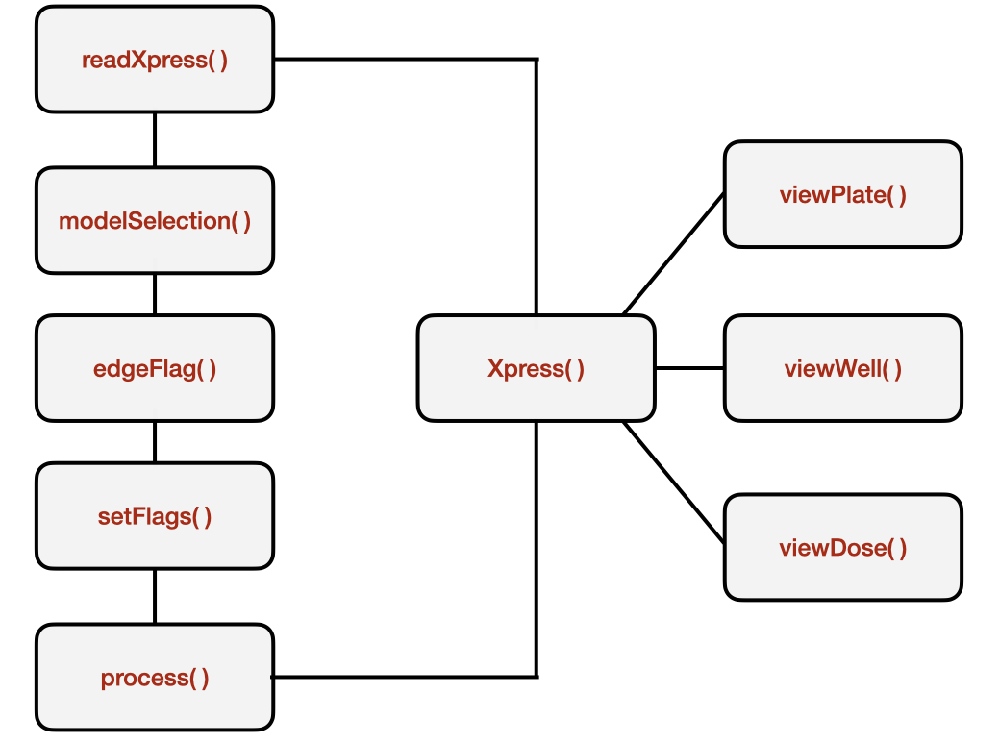

# easyXpress 

## Overview 
This package is designed for the reading, processing, and visualization of images obtained from the Molecular Devices ImageExpress Nano Imager, and processed with CellProfiler's WormToolbox. 

## Installation
`easyXpress` is specialized for use with CellProfiler generated worm image data. The package is rather specific to use in the Andersen Lab and, therefore, is not available from CRAN. To install_github easyXpress you will need the [`devtools`](https://github.com/hadley/devtools) package. You can install `devtools` and `easyXpress` using the commands below:

```r
install.packages("devtools")
devtools::install_github("AndersenLab/easyXpress")
```

The functionality of the package can be broken down into three main goals:

+ Reading data generated from CellProfiler pipelines alongside information about experimental design.

+ Flagging and pruning anomalous data points.

+ Generating diagnositic images.

For more information about implementing CellProfiler to generate data used by the `easyXpress` package, see [`Andersen Lab Image Analysis Pipeline`](https://github.com/AndersenLab/CellProfiler).

## Directory structure

Because so much information must be transferred alongside the plate data, the directory structure 
from which you are reading is critically important. Below is an example of a correct project directory structure. 
The `cp_data` directory contains an `.RData` file sourced directly from the default output folder for a CellProfiler run. 
The `processed_images` directory contains `.png` files from the CellProfiler run. There should be one `.png` file 
for each well included in your analysis. The `design` directory contains the `.csv` file having all the variables necessary
to describe your experiment (i.e. drug names, drug concentrations, strain names, food types, etc.).    
  
If you do not have condition information (i.e. drug names, drug concentrations, strain names, food types, etc.) 
you do not need the `design` directory.

```
/projects/20200812_example
├── cp_data
│   ├── CellProfiler-Analysis_20191119_example_data.RData
└── processed_images
│   ├── 20191119-growth-p01-m2x_A01_overlay.png
│   ├── 20191119-growth-p01-m2x_A02_overlay.png
│   ├── 20191119-growth-p01-m2x_A03_overlay.png
│   ├── ...    
├── design
    └── 20191119_design.csv
```
This directory exhibits the minimal file content and naming for the easyXpress package to work.

### Project directory

The project directory contains all of the files attached to a specific experiment conducted on a specific date. 
The naming convention for these folders should include the date in the format 4-digit year::2-digit month::2-digit day 
and experiment name separated by underscores. 

```
# Example directory name
# Date is January 1st, 2020
# Experiment name is "ExperimentName"

20200101_ExperimentName/
```

### File naming

The processed image files should be formatted with the experiment data, name of the experiment, the plate number, 
the magnification used for imaging, and the well name. All processed image files must be saved as `.png` files. 
In the file named `20191119-growth-p01-m2x_A01_overlay.png` the first section `20191119` is the experiment date, 
`growth` is the name of the experiment, `p01` is the plate number, `m2x` is the magnification used for imaging, 
and `A01` is the well name.

### Overview 
The complete easyXpress package consists of nine functions: 
`readXpress`, `modelSelection`, `edgeFlag`, `setFlags`, `process`, `Xpress`, `viewPlate`, `viewWell`, and `viewDose`.

For more detailed information regarding use of these functions, see the vignette.




  

