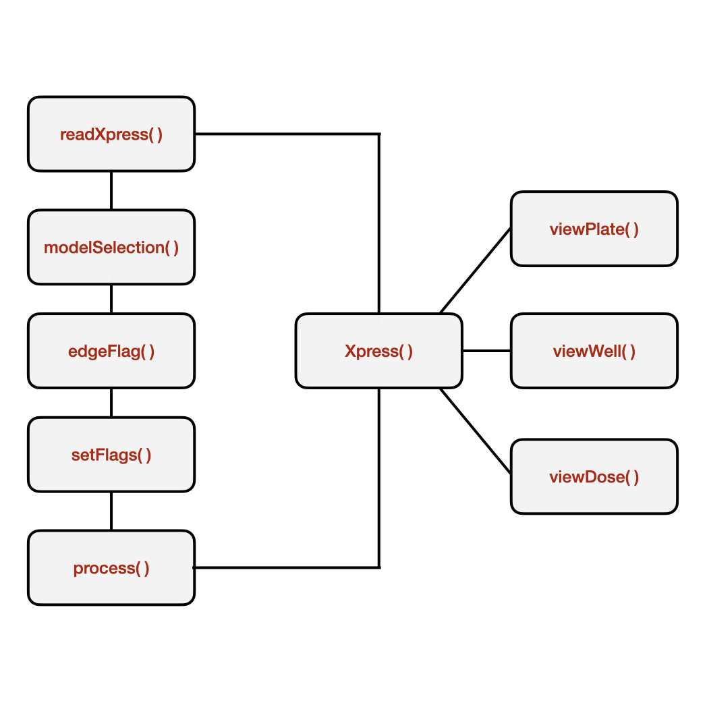

# easyXpress


easyXpress is specialized for use with CellProfiler generated worm image data. The package is rather specific to use in the Andersen Lab and, therefore, is not available from CRAN. To install easyXpress you will need the [`devtools`](https://github.com/hadley/devtools) package. You can install `devtools` and `easyXpress` using the commands below:

```r
install.packages("devtools")
devtools::install_github("AndersenLab/easyXpress")
```

The functionality of the package can be broken down into three main goals:

+ Reading data generated from CellProfiler pipelines alongside information about strains, conditions, controls, and experimental design.

+ Flagging and pruning anomalous data points

+ Generating diagnositic images

For more information about implementing CellProfiler to generate data used by the `easyXpress` package, see [`Andersen Lab Image Analysis Pipeline`](https://github.com/AndersenLab/CellProfiler).

## Directory structure

Because so much information must be transferred alongside the plate data, the directory structure from which you are reading is critically important. Below is an example of a correct project directory structure. The `cp_data` directory contains an `.RData` file sourced directly from the default output folder for a CellProfiler run. The `processed_images` directory contains `.png` files from the CellProfiler run. There should be one `.png` file for each well included in your analysis. The `design` directory contains the `.csv` file having all the variables necessary to describe your experiment (i.e. drug names, drug concentrations, strain names, food types, etc.). The `.cpproj` file is not used by easyXpress, but is advised to reproduce the original analysis. If you do not have condition information (i.e. drug names, drug concentrations, strain names, food types, etc.) you do not need the `design` directory.

```
/projects/20200812_toxin01A
├── cp_data
│   ├── CellProfiler-Analysis_20200812_toxin01A_20200813.RData
└── processed_images
│   ├── 20200812-toxin01A-p01-m2x_A01_overlay.png
│   ├── 20200812-toxin01A-p01-m2x_A02_overlay.png
│   ├── 20200812-toxin01A-p01-m2x_A03_overlay.png
│   ├── ...    
├── design
    └── 20200812_design.csv
└── 20200812_toxin01A_CPpipeline.cpproj
```
This directory exhibits the minimal file content and naming for the easyXpress package to work.

### Project directory

The project directory contains all of the files attached to a specific experiment conducted on a specific date. The naming convention for these folders should include the date in the format 4-digit year::2-digit month::2-digit day and experiment name separated by underscores. 

```
# Example directory name
# Date is January 1st, 2020
# Experiment name is "ExperimentName"

20200101_ExperimentName/
```

### File naming

The processed image files should be formatted with the experiment data, name of the experiment, the plate number, the magnification used for imaging, and the well name. All processed image files must be saved as `.png` files. In the file named `20200812-toxin01A-p01-m2x_A01_overlay.png` the first section `20200812` is the experiment date, `toxin01A` is the name of the experiment, `p01` is the plate number, `m2x` is the magnification used for imaging, and `A01` is the well name.

## Pipeline

The complete easyXpress package consists of ten functions: `readXpress`, `modelSelection`, `edgeFlag`, `setFlags`, `process`, `Xpress`, `viewPlate`, `viewWell`, and `viewDose`.

### `read_data()`

`read_data()` takes as an argument a path to a project directory with CellProfiler data files. This directory should have CellProfiler data in a sub-folder named `cp_data`. The data can be in .RData, .Rds, or .csv formats. If `design = TRUE`, a design file will be joined to data. The design file should be located in a sub-folder of the experimental directory named design. If `design = FALSE`, no design file will be joined. This function will output a single data frame containing all CellProfiler model outputs as well as experimental treatments if a design file is used.

For further information use the command `?readXpress` to access the documentation.

### `modelSelection()`

`modelSelection()` takes as an argument the raw data output from the `readXpress()` function. It will assign the appropriate CellProfiler model to each primary object in the data frame.

For further information use the command `?modelSelection` to access the documentation.

### `edgeFlag()`

`edgeFlag()` will flag worms near the well edge. It takes as input the standard output from the `modelSelection()` function. 

For further information use the command `?modelSelection` to access the documentation.

### `setFlags()`

`setFlags()` takes data following `modelSelection` and `edgeFlag` as input and outputs a single data frame containing all identified flags (i.e. worm cluster flag, well edge flag, well outlier flag).

For further information use the command `?setFlags` to access the documentation.

### `process()`

`process()` takes as an argument the flagged data output from the `setFlags()` function. It will output a list containing four elements: raw data, processed data, and summaries for both datasets. The raw data list item will be identical to the output from the `readXpress()` function. The processed data list item will be the raw data following removal of all identified flags from the `setFlags()` function. The two summary outputs will be data after summarizing by supplied parameter `...`.

For further information use the command `?process` to access the documentation.

### `Xpress()`

`Xpress()` is a wrapper function that will run all of the above functions in the package. The user must specify each input argument: `design = FALSE`, `radius = 825`, `cluster_flag = TRUE`, `well_edge_flag = TRUE`, `... = variable used to summarize data`.

For further information use the command `?Xpress` to access the documentation.

### `viewPlate()`

`viewPlate()` takes as input either the raw or processed data output from the `process()` function. It will output a plotly object with information the selected plate information displayed.

For further information use the command `?viewPlate` to access the documentation.

### `viewWell()`

`viewWell()` takes as input either the raw or processed data output from `process` as well as the full path of the directory holding the processed images. It returns a plot of the processed well image with object centroids colored by type. Optional argument `boxplot = TRUE` includes a boxplot of the objct data with the well image.

For further information use the command `?viewWell` to access the documentation.

### `viewDose()`

`viewDose()` takes as input either the raw or processed data output from `process` and outputs representative processed well images with object centroids colored by type for each concentration of a drug.

For further information use the command `?viewDose` to access the documentation.

### Overview



  
### Example
```r
library(easyXpress)

# Define your experimental directory
dirs <- "/projects/20200812_toxin01A"

# Read in the data
raw <- readXpress(dirs, design = TRUE)

# Select appropriate generalized model dataframe
model_selected <- modelSelection(raw)

# Assign edge flags
edge_flagged <- edgeFlag(model_selected, radius = 825)

# Flag all suspect data points within wells
raw_flagged <- setFlags(edge_flagged, cluster_flag = TRUE, well_edge_flag = TRUE)

# Process and summarize data
processed <- process(raw_flagged, Metadata_Well)

# Review suspect data with image overlay
proc_imgs <- "projects/20200812_toxin01A/processed_images"
p1 <- viewWell(df, img_dir = proc_imgs, plate = "p02", well = "A05", boxplot = TRUE)

...
# Using the wrapper function
final_df <- Xpress(dirs, design = TRUE, radius = 825, cluster_flag = TRUE, well_edge_flag = TRUE, Metadata_Well)


```
